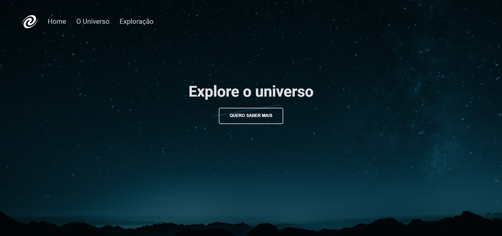

<h1 align="center"> 👩‍🚀 SPA | Universe </h1>

Este projeto foi desenvolvido no Stage 06 do Explorer, o primeiro desafio foi criar um SPA com rotas no JavaScript!

  

 

# 🔨 Funcionalidades do projeto

`Funcionalidade 1`: Clicar no botão, e se redirecionar para O Universo.

`Funcionalidade 2`: Navegar entre páginas.

`Funcionalidade 3`: Navegar com as setinhas do navegador.

 

# 🚀 Tecnologias

As seguintes ferramentas foram usadas na construção do projeto:

- HTML
- CSS
- JavaScript
- Node.js

 

# 💻 Você pode acessar [aqui](https://spa-universe-livid.vercel.app/)

 feito com ❤ por <a href="https://www.instagram.com/palomarodrigsb" target="_blank">@palomarodrigsb</a>

